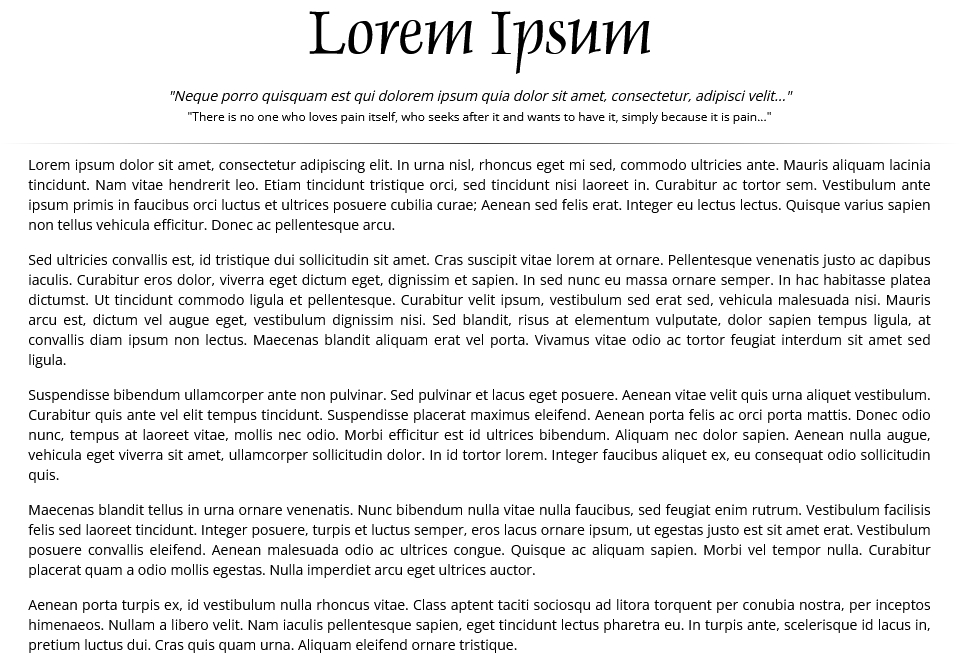
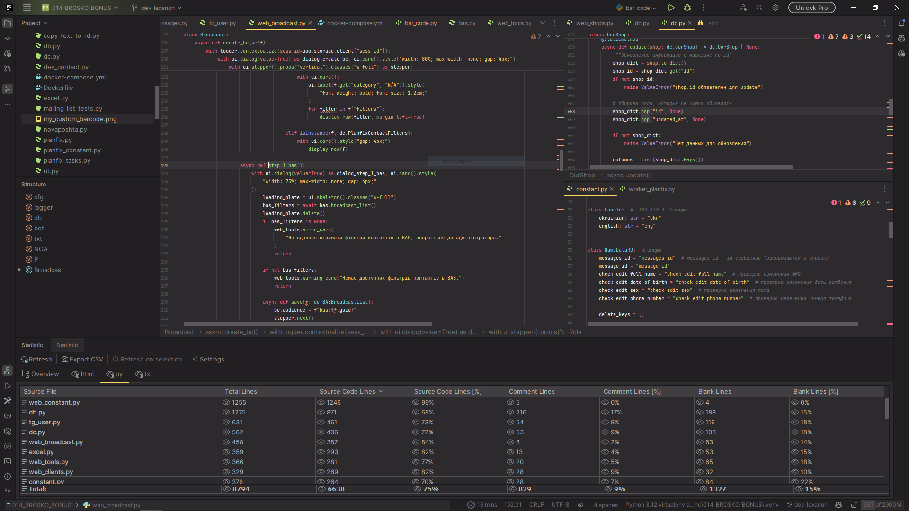
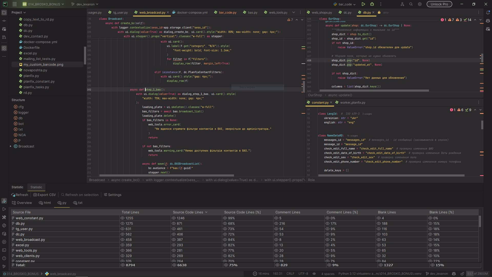
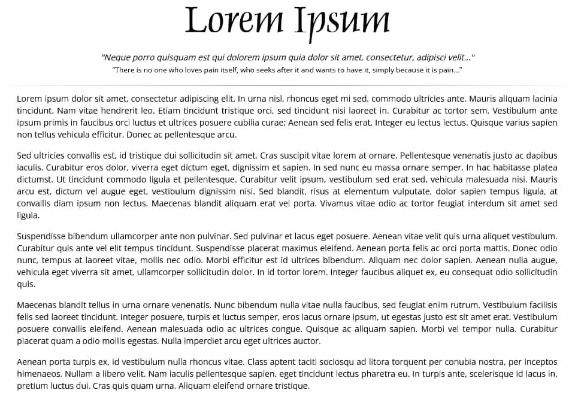
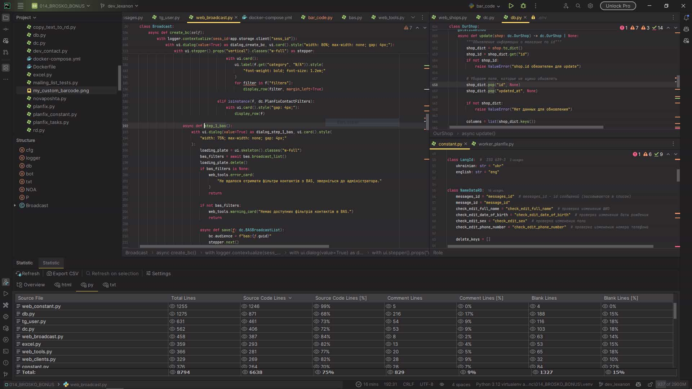
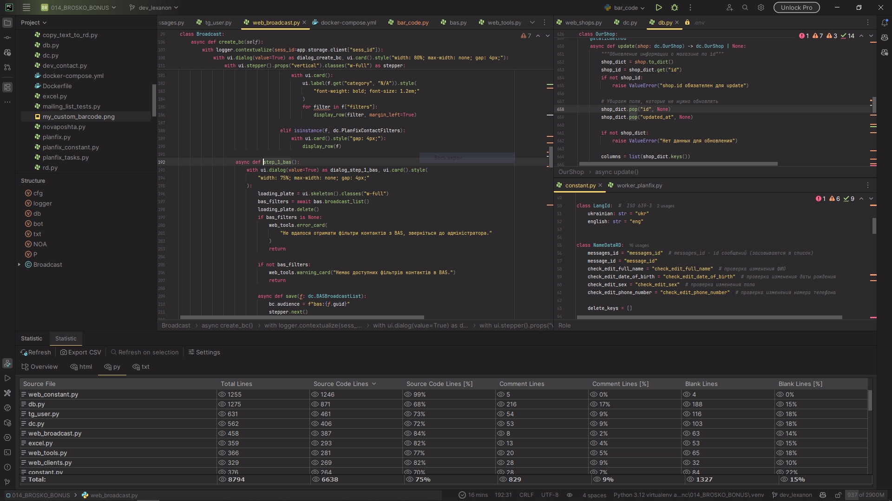
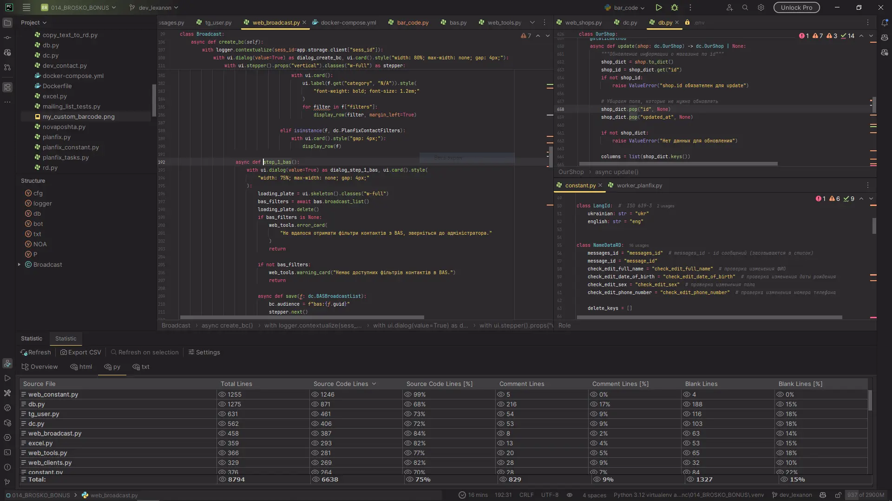
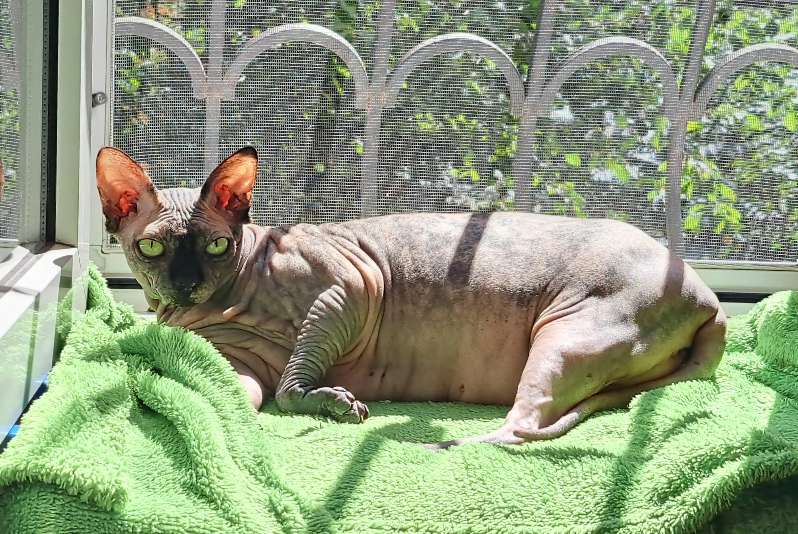
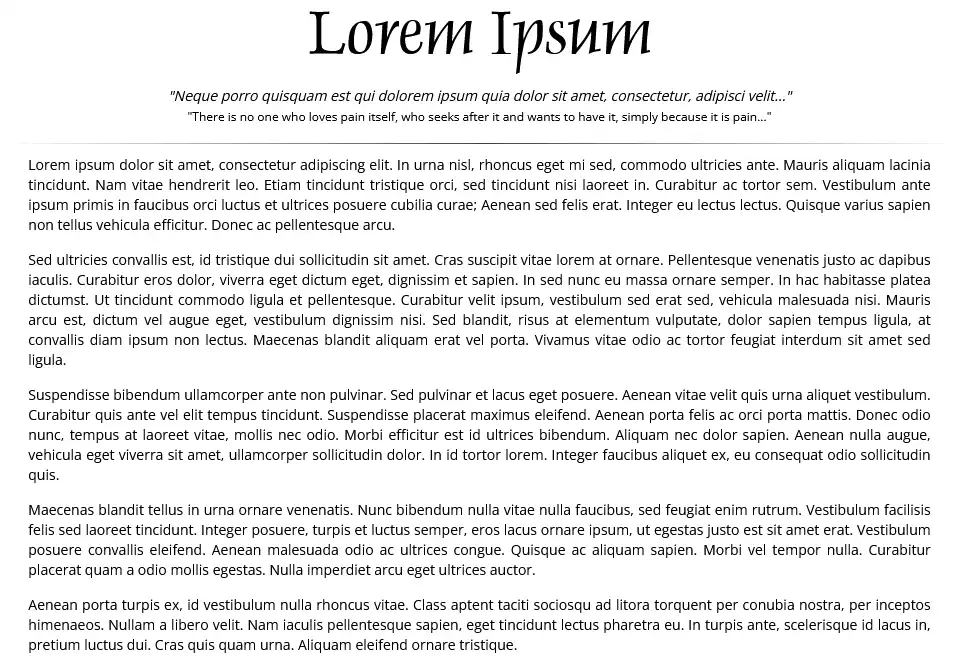
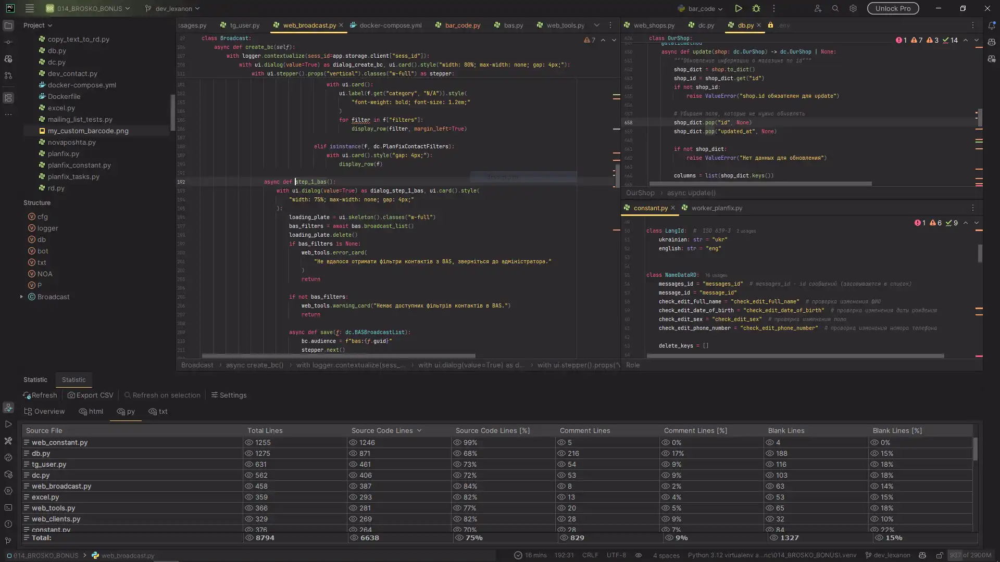

# Практична №1 - [Squoosh](https://squoosh.app/) оптимізація

### Виконав:  
**Рєпін Олексій**, Група: **ІПЗ-2.03**
## 1. Референсні зображення

| Назва                | Тип        | Формат | Вага       | Розмір    |
| -------------------- | ---------- | ------ | ---------- | --------- |
| orig_lorem_ipsum.png | Текст      | PNG    | 112.65 КБ  | 960x662   |
| orig_screenshot.png  | Скриншот   | PNG    | 312.87 КБ  | 1920x1080 |
| orig_shaya.jpg       | Фотографія | JPEG   | 2205.09 КБ | 3059x2052 |
## 2. Порівняння розмірів

Вот таблица в формате Markdown с данными о размерах файлов для каждого типа и формата:

| Тип        | MozJPEG 100% | WebP (lossy) 100% | AVIF 100%  | MozJPEG 75% | WebP (lossy) 75% | AVIF 75%  | MozJPEG 50% | WebP (lossy) 50% | AVIF 50%  |
| ---------- | ------------ | ----------------- | ---------- | ----------- | ---------------- | --------- | ----------- | ---------------- | --------- |
| Текст      | 310.52 КБ    | 174.20 КБ         | 177.35 КБ  | 114.28 КБ   | 100.51 КБ        | 107.59 КБ | 81.01 КБ    | 87.92 КБ         | 82.71 КБ  |
| Скриншот   | 922.67 КБ    | 276.12 КБ         | 163.22 КБ  | 156.34 КБ   | 111.66 КБ        | 69.44 КБ  | 101.15 КБ   | 90.36 КБ         | 46.09 КБ  |
| Фотографія | 3700.86 КБ   | 2480.96 КБ        | 2338.13 КБ | 881.03 КБ   | 755.61 КБ        | 839.70 КБ | 587.56 КБ   | 579.63 КБ        | 426.31 КБ |
## MozJPEG
##### MozJPEG 100%

##### MozJPEG 75%

##### MozJPEG 50%

## WebP (lossy)
##### WebP 100%

##### WebP 75%

##### WebP 50%

## AVIF
##### AVIF 100%

##### AVIF 75%

##### AVIF 50%

## Висновки

1. **Текст**:
    - Найкраще стиснення показав **AVIF**, особливо при 50% якості.
    - **WebP** також ефективний, але поступається AVIF.
    - **MozJPEG** має найбільші розміри файлів.
2. **Скриншот**:
    - **AVIF** значно виграє у стисненні, особливо при 50% якості.
    - **WebP** показав хороші результати, але AVIF ефективніший.
    - **MozJPEG** має найбільші розміри файлів.
3. **Фотографія**:
    - **AVIF** найефективніший для стиснення, особливо при високих рівнях якості.
    - **WebP** також добре працює, але поступається AVIF.
    - **MozJPEG** має найбільші розміри файлів.

### Рекомендації

1. **Для веб-додатків**:
    - Використовуйте **AVIF** для максимального стиснення і якості.
    - Якщо AVIF не підтримується, використовуйте **WebP**.
2. **Для архівування**:
    - Використовуйте **MozJPEG** для максимальної якості, якщо розмір файлу не є критичним.
3. **Для текстових зображень**:
    - Використовуйте **AVIF** або **WebP** з рівнем якості 50% для оптимального балансу між якістю і розміром.
4. **Для скріншотів і фотографій**:
    - Використовуйте **AVIF** з рівнем якості 75% для хорошого балансу між якістю і розміром файлу.

### Додатковий коментар

Користувачі, які будуть намагатись скопіювати та потім використовувати зображення з сайту, будуть вас ненавидити, якщо зображення будуть не у png або jpeg форматах, тому-що інші формати не всюди підтримуються нативно :)