# Практична робота №11. Вивчення кольорових гармоній та інструментів аналізу кольору в Adobe Color
### Виконавець:
**Рєпін Олексій**, Група: **ІПЗ-2.03**
## Кольорова гармонія
Кольорова гармонія - це принцип комбінування кольорів, які добре поєднуються між собою, створюючи естетично приємне враження. Вона базується на взаємодії кольорів у колірному колі, такому як контраст, подібність або баланс.
## Типи кольорової гармонії
|Тип|Опис|
|---|---|
|Аналогічна|Використовує сусідні кольори на колірному колі|
|Монохроматична|Використовує різні відтінки одного кольору|
|Тріада|Використовує три кольори, рівномірно розподілених по колірному колу|
|Комплементарна|Використовує протилежні кольори на колірному колі|
|Розділена комплементарна|Використовує основний колір та два сусідні до комплементарного|
|Квадратна|Використовує чотири кольори, рівномірно розподілених по колірному колу|
|Власна побудова|Індивідуальний підбір кольорів|
## Колірні моделі
|Модель|Опис|
|---|---|
|RGB|Модель на основі червоного, зеленого та синього світла, використовується в цифрових зображеннях|
|HSB|Модель, яка представляє колір у спосіб, близький до людського сприйняття|
|LAB|Модель, що імітує сприйняття кольору людським оком, використовується в друці та фотографії|
## Перевірка доступності через контрастність
Контрастне співвідношення вимірює різницю в яскравості між текстом і фоном. Воно варіюється від 1:1 (відсутність контрасту) до 21:1 (максимальний контраст).
## WCAG
WCAG - міжнародні стандарти веб-доступності, що визначають мінімальні рівні контрасту для забезпечення доступності контенту.
|Рівень|Звичайний текст|Великий текст|
|---|---|---|
|AA|Мінімум 4.5:1|Мінімум 3:1|
|AAA|Мінімум 7:1|Мінімум 4.5:1|
## Завдання:
1. Ознайомитися з поняттям кольорової гармонії, її типами та колірними моделями
2. Створити палітри за різними принципами гармонії за допомогою Adobe Color
3. Згенерувати палітри зображень (Extract Theme) та градієнт (Extract Gradient)
4. Перевірити контрастність кольорових пар відповідно до стандартів доступності (WCAG)
5. Написати звіт
## Палітри
### Аналогічна палітра:
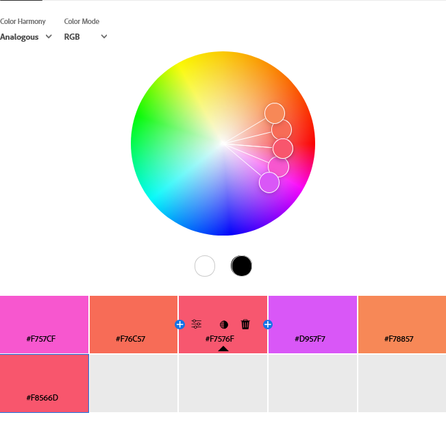
- Основний колір: #F8566D
- Принцип: Суміжні кольори на колірному колі
- Ефект: Плавний перехід, гармонійне поєднання, підходить для природних дизайнів
### Монохроматична палітра:
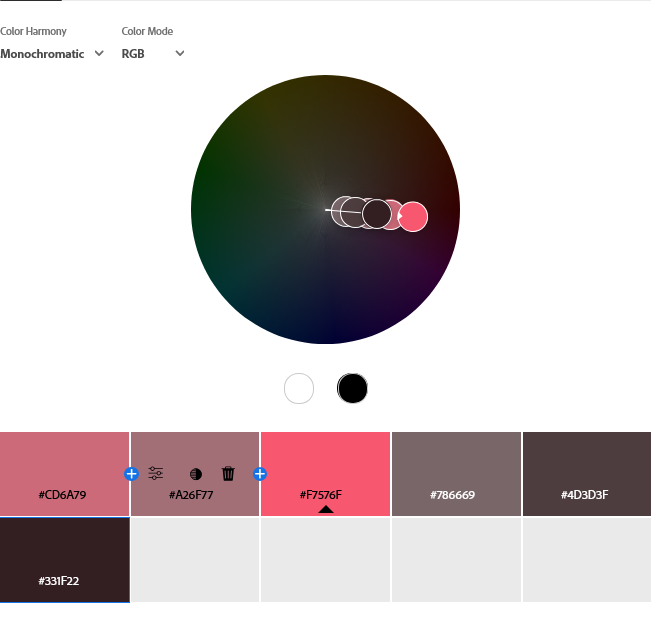
- Основний колір: #F8566D
- Принцип: Відтінки одного кольору
- Ефект: Елегантний вигляд, підходить для стильних інтерфейсів
### Тріада:
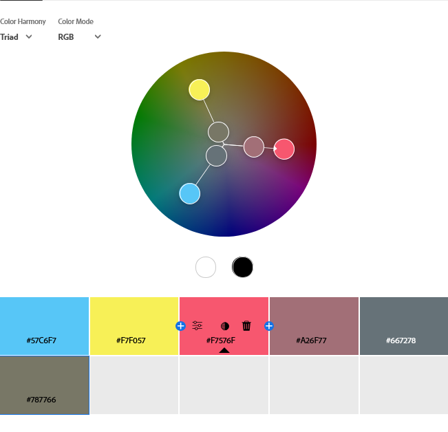
- Основний колір: #F8566D
- Принцип: Три кольори на рівній відстані на колірному колі
- Ефект: Збалансоване поєднання, виглядає динамічно
### Комплементарна палітра:
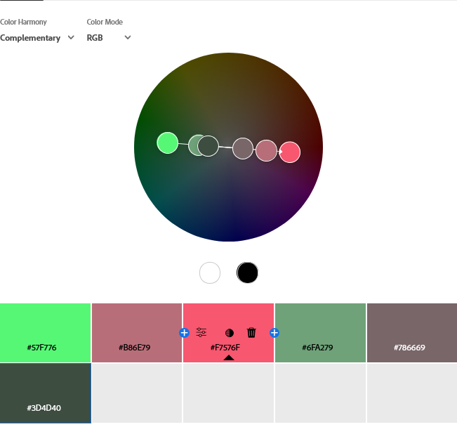
- Основний колір: #F8566D
- Принцип: Протилежні кольори
- Ефект: Високий контраст, привертає увагу
### Розділена комплементарна палітра:
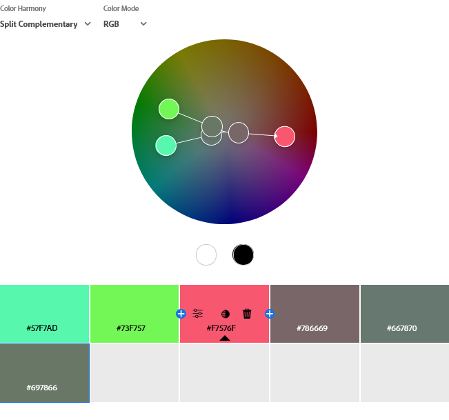
- Основний колір: #F8566D
- Принцип: Основний колір та два сусідні до протилежного
- Ефект: Контрастне, але збалансоване поєднання
### Квадратна палітра:
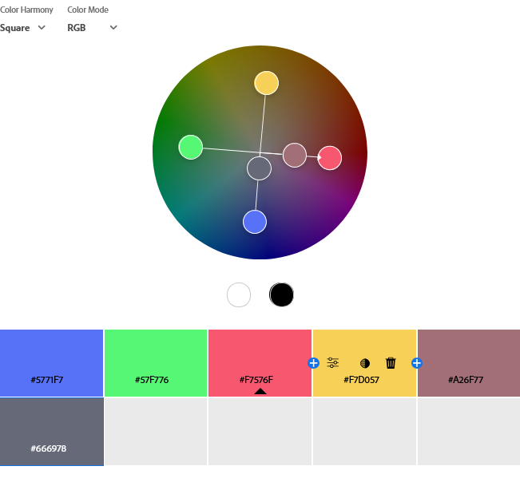
- Основний колір: #F8566D
- Принцип: Чотири кольори на рівній відстані
- Ефект: Яскраве поєднання, підходить для динамічних дизайнів
### Користувацька палітра:
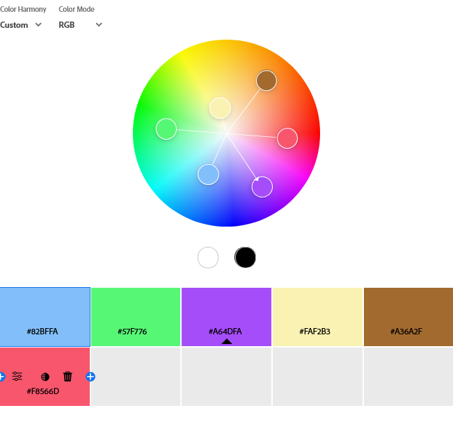
- Кольори: #82BFFA #57F776 #A64DFA #FAF2B3 #A36A2F #F8566D
- Принцип: Індивідуальний підбір
- Ефект: Унікальне поєднання, може відповідати бренду
## Палітри зображень та градієнти
### Зображення для аналізу:

### Палітра Colorful:
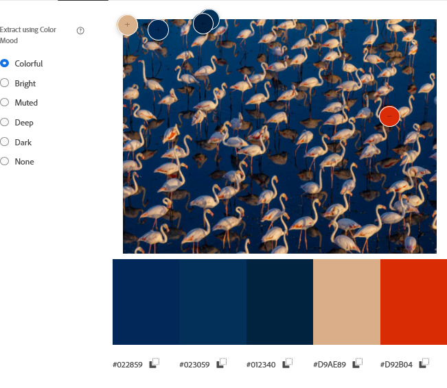
- Кольори: Насичені зелені та природні тони
- Використання: Дизайн з акцентом на природу
### Палітра Muted:
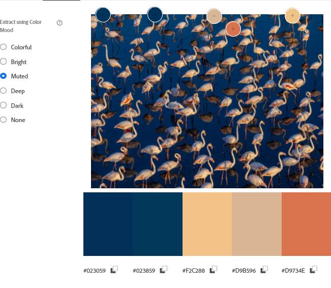
- Кольори: М'які, менш контрастні кольори
- Використання: Інтерфейси, що не відволікають увагу
### Градієнт:

- Кольори: Темний оливково-чорний → майже чорний з теплим відтінком → світлий кремовий/бежевий → оливково-зелений
- Використання: Фони сайтів, панелі, графічні переходи
## Перевірка контрастності
### Рівень AA:
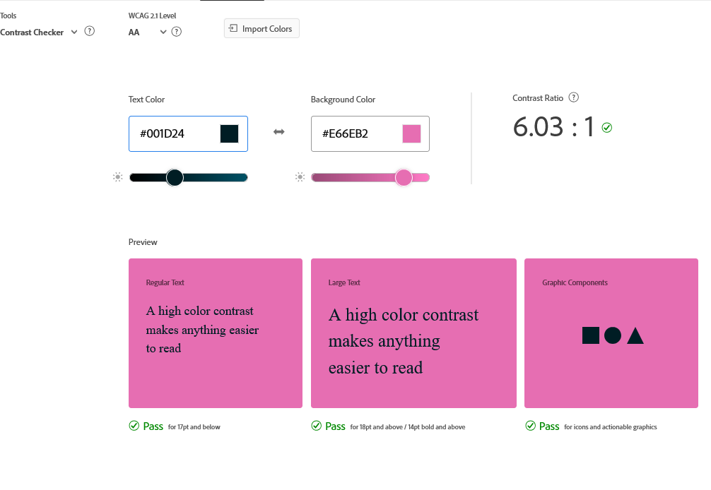
- До корекції: Контраст 4.2:1 (недостатній)
- Після корекції: Контраст 6.03:1 (відповідає стандартам)
### Рівень AAA:
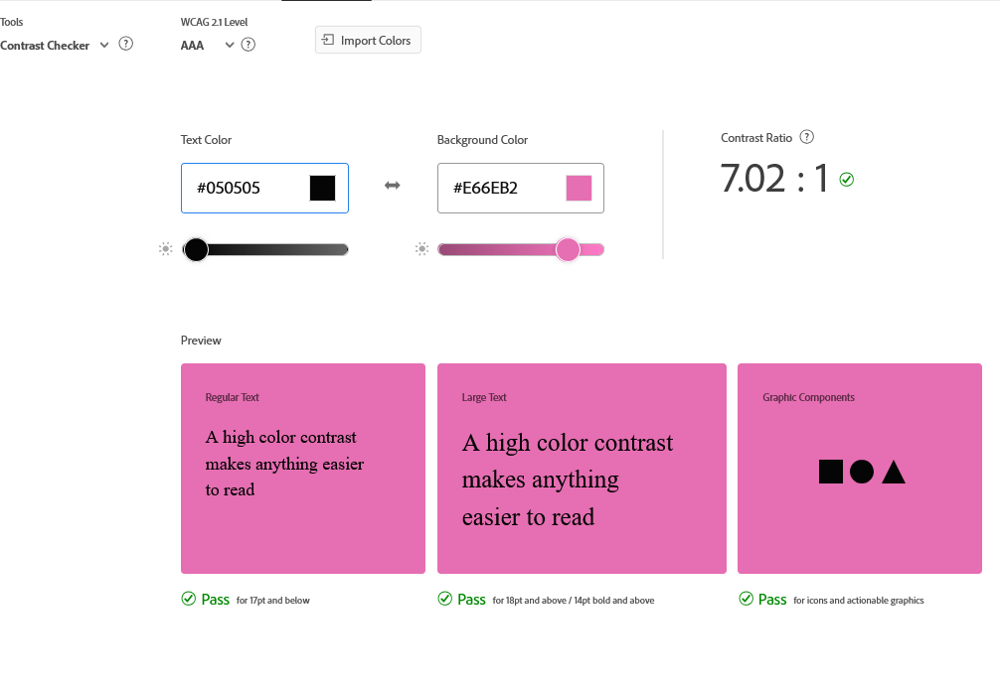
- До корекції: Контраст 4.2:1 (недостатній)
- Після корекції: Контраст 7.02:1 (відповідає високим стандартам)
## Висновки
### 1. Монохроматична палітра
- **Найкращий вибір для інтерфейсів**
- Створює єдину атмосферу з варіаціями одного кольору
- Легко контролювати контрастність
- Підходить для професійних дизайнів
### 2. Аналогічна палітра
- М'яке, природне поєднання
- Підходить для природних тем
- Можливо, потребує контрастних акцентів
### 3. Комплементарна палітра
- Максимальний контраст
- Ефективна для акцентів
- Не підходить для основного інтерфейсу
### 4. Розділена комплементарна палітра
- Збалансована альтернатива комплементарній
- Підходить для емоційних, але стабільних інтерфейсів
### 5. Тріада
- Динамічне, але збалансоване поєднання
- Підходить для освітніх та мультимедійних проектів
### 6. Квадратна палітра
- Насичене поєднання чотирьох кольорів
- Підходить для яскравих дизайнів
- Вимагає чіткого розмежування кольорових зон
### 7. Користувацька палітра
- Найкращий варіант для персоналізованих дизайнів
- Важливо перевіряти контрастність
### Палітри зображень
- **Colorful**: Яскраві кольори для креативних проектів
- **Muted**: Стримані кольори для інтерфейсів
- Для інтерфейсів краще підходить Muted через кращу читабельність
### Градієнти зображень
- Градієнт з 3 точок створює глибину фону
- Підтримує візуальну цілісність інтерфейсу
- Підходить для фонових блоків та банерів
### Доступність
- Важливо дотримуватися стандартів WCAG
- Багато кольорових комбінацій не відповідають стандартам контрастності
- Adobe Color пропонує автоматичні альтернативи для покращення доступності
- Контрастність критично важлива для користувачів з вадами зору
## Загальні рекомендації
Для створення зручного та доступного інтерфейсу:
- Використовуйте збалансовані палітри (монохроматичну, аналогічну або тріаду)
- Уникайте надто яскравих схем без перевірки контрасту
- Використовуйте зображення як джерело стриманих палітр та градієнтів
- Завжди перевіряйте відповідність стандартам доступності WCAG
