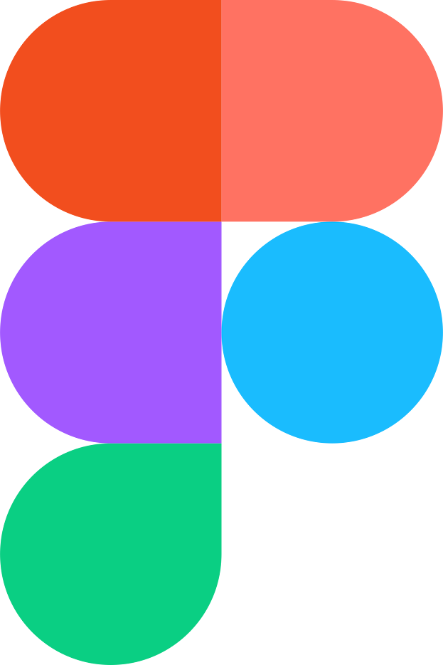
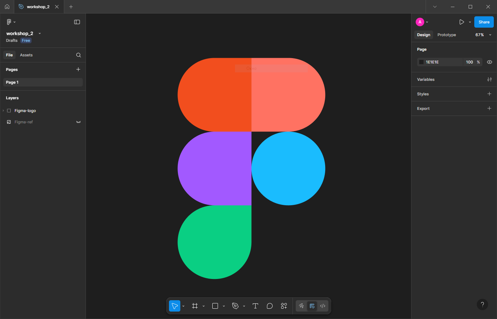

# Практична №2 - Робота з простими формами та їх властивостями
### Виконав:
**Рєпін Олексій**, Група: **ІПЗ-2.03**
## Завдання:
1. Переглянути матеріал лекції
2. Повторити дизайн логотипу Фігми
3. Написати звіт
---
## Хід роботи:
1. Аналіз
    - Логотип Фігми складається з 5 частин
    - Використані різні кольори, а саме: `#F24E1E`, `#FF7262`, `#A259FF`, `#1ABCFE`, `#0ACF83`
2. Розробка
    - Використати інструмент Rectangle(Квадрат)
    - Утримувати Shift, розтягнути до потрібних розмірів
    - Здублювати квадрат ще 4 рази
    - Зменишити кути
    - Використовуючи піптик, щоб зібрати колір з референсу
    - Розмалювати квадратики
3. Результати

| Елемент | Результат |
| - | - |
| Лого Фігми |  |
| Скріншот | 

Посилання на проект: [workshop_2](https://www.figma.com/design/lMVtPf4XHOL5O1707yWKTd/workshop_2?node-id=0-1&t=mlYLpgwFvOnuWNHQ-1)
