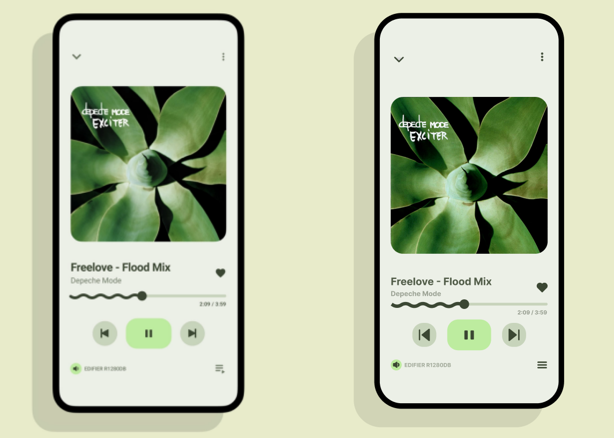
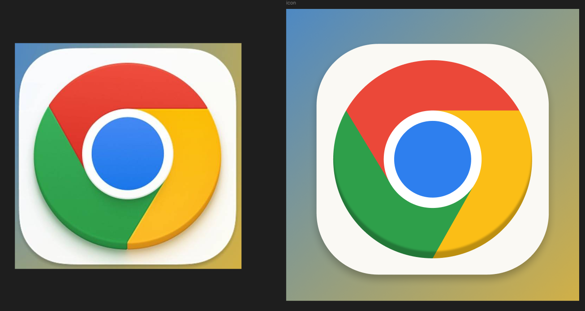

### Виконав:
**Рєпін Олексій**, Група: **ІПЗ-2.03**

## Завдання:
1. Розглянути завдання Advanced та Medium **(друга частина завдання)** із прикріпленого документа
2. Повторити у фігмі “один в один” елемент дизайну представлені у файлі
3. Написати звіт

---

## Хід роботи:
1. Аналіз
    - Іконка Chrome складається з основи (білий квадрат із закругленими кутами) та центрального елементу (кольорові сектори та синій круг)
    - Інтерфейс плеєра містить головний екран із обкладинкою, елементами управління та текстом
    - Обидва дизайни мають м'які тіні та ефект об'єму
    - Колірна гама: Chrome використовує червоний, жовтий, зелений і синій; плеєр — пастельні тони та чорний контур
2. Розробка
    - Іконка Chrome:
        - Створення білого закругленого квадрата
        - Побудова центрального кола та кольорових секторів (червоний, жовтий, зелений)
        - Додавання синього кола в центрі з білим обводом
        - Додавання тіні для створення 3D-ефекту
    - Мобільний плеєр:
        - Створення основи (чорний контур телефону, внутрішній екран)
        - Розміщення зображення обкладинки
        - Додавання текстових елементів (назва пісні, виконавець, таймер відтворення)
        - Розташування елементів управління (кнопки навігації, прогрес-бар, іконки та інше)
        - Додавання м'якої тіні до елементів
3. Результати
    
    

Посилання на проект: [workshop_5](https://www.figma.com/design/2n27LlaT6vElXLu5FuT5OM/workskop_5?node-id=0-1&t=lrrYtUxV299dFstr-1)
