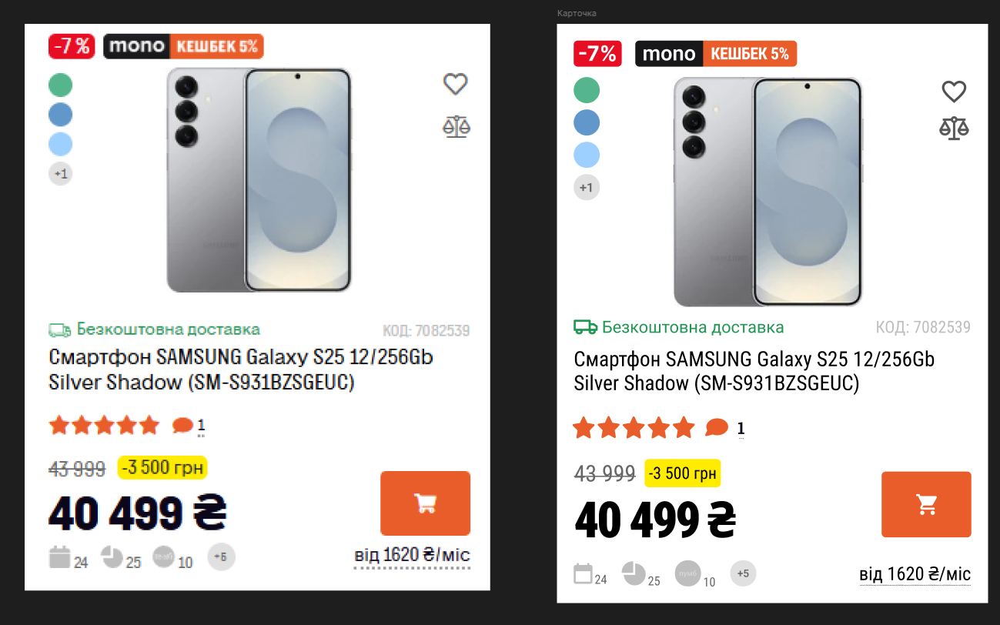

# Практична №9 Створення картки товару з використанням Auto Layout
### Виконав:
**Рєпін Олексій**, Група: **ІПЗ-2.03**
## Завдання:
1. Створити малу картку товару, використовуючи функцію Auto layout у Figma
2. При оформленні використати відповідне зображення, текст, значки
---

Посилання на проект: [workshop_8](https://www.figma.com/design/IvOqn1g4jWQ5hlZlNLcskJ/workshop_8?node-id=0-1&t=Q7DBhQbLIONNlivp-1)
